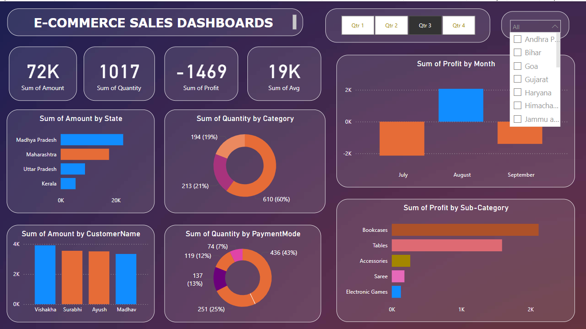

# 📊 E-commerce Sales Dashboard using Power BI

This project showcases a fully interactive **Power BI dashboard** built to analyze and visualize e-commerce sales data.

## 🚀 Features
- Total Sales Amount, Quantity, Profit & Average
- Sales by State and by Customer
- Quantity by Category and by Payment Mode
- Profit Trends by Month and Sub-Category
- Interactive filters for Quarters and Category

## 🛠 Tools Used:
- Power BI Desktop
- DAX (Data Analysis Expressions)
- Data Modeling

## 📸 Screenshot:

## 🎥 Video Demo:
Watch the dashboard walkthrough:  
**[Click to Play the Video](Ecommerce-Sales%20data%202025-06-30%2017-39-07.mp4)**

## 📁 File Included:
- `Ecommerce-Sales data.pbix` – Power BI dashboard file
